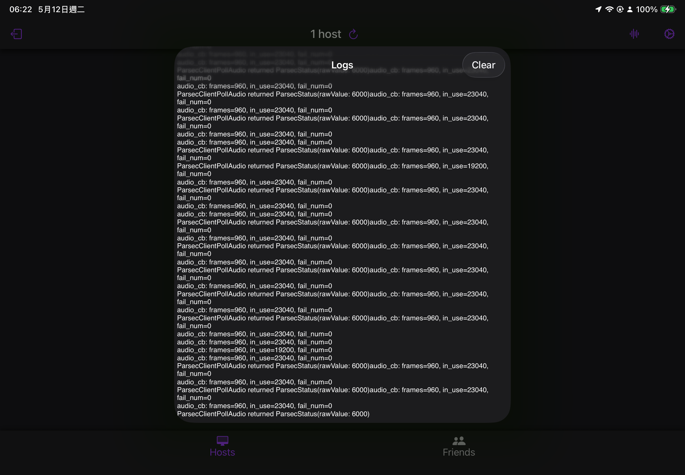

# 日誌功能模塊



這部分目前存在與 `audio.c` 中
未來可能會把它拆到其他單獨 C文件中 做區分

以及Swift 主要由這 3個檔案組成

- `Loggger.swift`
- `LogViewController.swift`
- `LogViewWrapper.swift`

當你要在Swift端寫日誌 使用以下

```swift
write_log_from_swift("日誌內容")
```

當你要在 像`audio.c` C文件寫日誌 使用以下

```c
write_log(msg);
```


# 設置日誌啟用與關閉

```swift
set_logging_enabled(true)
```

```swift
set_logging_enabled(false)
```

