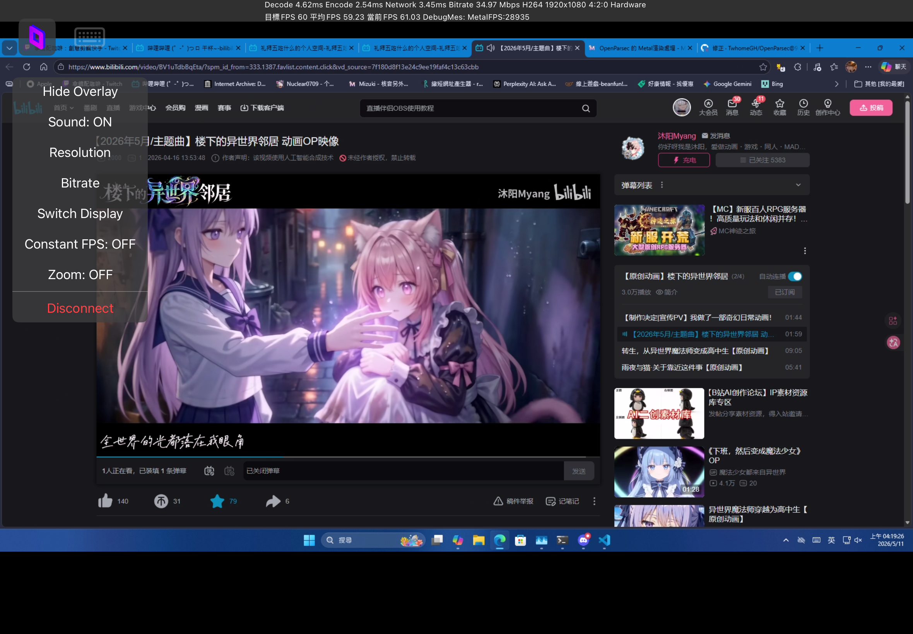
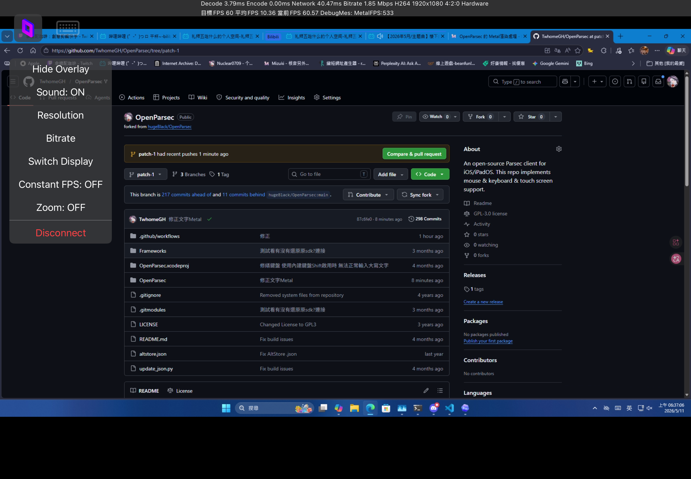
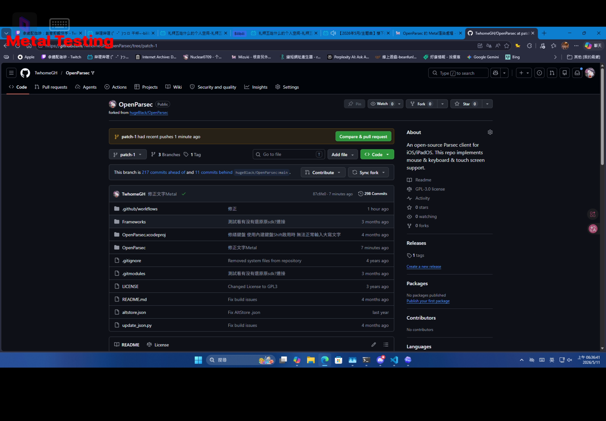
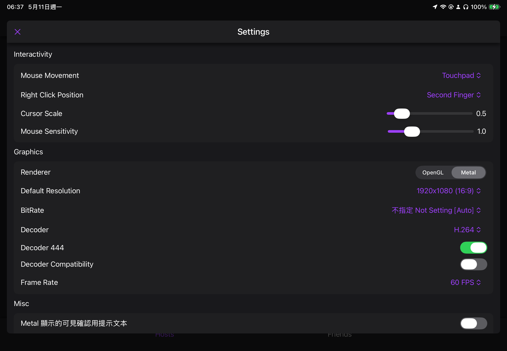

# Metal 渲染處理

  
  
  
  

這部分已成功處理 這也確認 我設想的方式是可行的

ParsecClientPollFrame 就是只拿幀數據
後續加工可以完全走單獨管線 Metal

ParsecClientGLRenderFrame 這是SDK以前遺留產物留下 確定可用 由SDK處理
而ParsecClientMetalRenderFrame 這已知他內部提供接口是缺失

甚至缺失ParsecClientMetalTextureCreate之列的 以及renderPipe不存在
（之前測試 是他內部 renderPipe沒有建立或出錯不存在

甚至沒有ParsecClientMetalDestroy 清理資源相關的

後續理解 ParsecSDK 其實他這個東西

- ParsecClientGLRenderFrame
- ParsecClientMetalRenderFrame

白話就是 我只管建GLKView/MTKView

畫面怎麼餵我不處理 SDK內部處理好並餵給GLKView / MTKView 之類的

而ParsecClientPollFrame 就是我只拿畫面數據 還沒有經過任何加工處理的原始數據

後續你要呈現 給GLKView也好 還是MTKView 你自己處理

因此這此 Metal渲染 就是基於此基礎實現的

# RenderCenter.swfit

這是我用來全局共用管理 的 一個中渠件 OpenGL/Metal 渲染切換用

# SettingsHandler.swfit 改動為全局共用件

在之前的版本你會發現

他是 `SettingsView.swift` 與 `SettingsHandler.swift`

會同時出現兩組 `@AppStorage(...)`

現在把他統一由 `SettingsHandler.swift` 為全局共用件使用

# SettingsView.swift

新增了 BitRate 的選項
新增了 Decorder444 的選項

